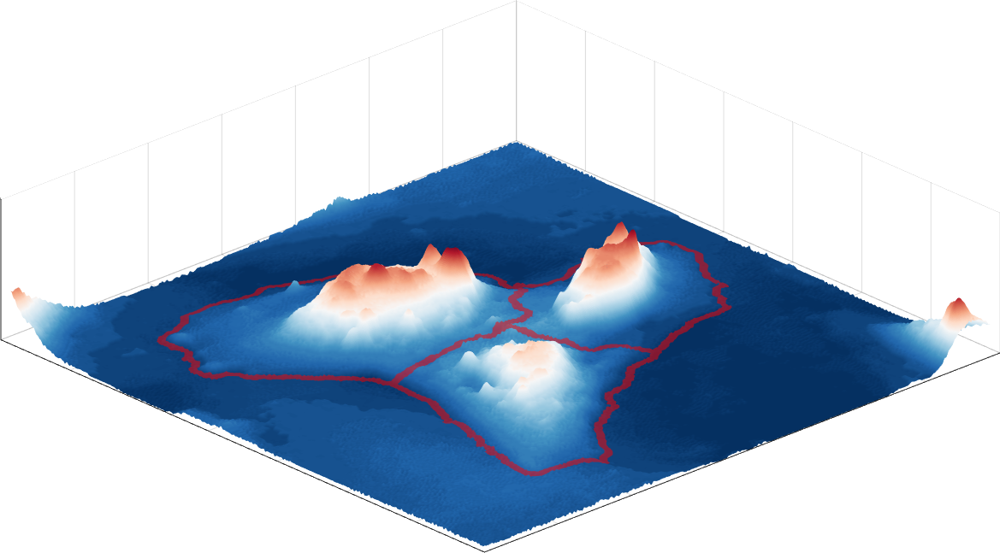

# PhaseCut - *A training-free segmentation for Quantitative Phase Imaging (QPI)*

    

**PhaseCut** is a training-free segmentation algorithm for quantitative phase images (QPI). Leveraging the intrinsic geometry of cells, the algorithm identify individual cells from clusters by the cell cortices and textures, achieving instance segmentation in single cell precision even in densely seeded 2D culture.

## Why training-free?
The majority of state-of-the-art segmentation algorithms rely on deep-learning, which achieve unprecedented segmentation accuracy. However, Prolonged labour-intensive effort has to be spent to manually annotate and generate enourmous amount of training data. Moreover, the common caveat of deep learning, generalizability, limits its application to other cell types, perturbation.

## How to achieve training-free?
QPI intrisically captures the pseudo-3D information in its contrast. This helps the algorithm to decipher the pseudo-3D morphology of the cells and identify the cell cortices. Q-Segmenter leverages this information and the texture appearing in the image to segment the cells. Divided in three main steps, the algorithm segments the cells into single cells and refine the cell boundaries. 

## Required data format
A quantitative phase image saved as any indexed image format (e.g. bmp, png, jpg). Spatial and phase scales should be specified in the code.

## Project origin
This is part of a larger project coined Spinning Arrayed Disk (SpAD).
